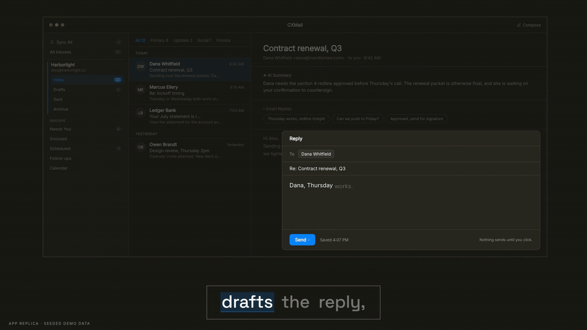

# CXMail

A macOS-first email client with a Rust (Tauri 2) backend and a React 19 + TypeScript frontend.
It speaks IMAP/SMTP directly, sanitizes and sandboxes all rendered mail, and ships a built-in
[MCP server](docs/mcp-setup.md) so Claude can search, draft, and send email for you.



<sub>App replica with seeded demo data. [Watch the full 50-second film with sound](https://cxventures.io/products/cxmail).</sub>

## Get it

Two ways, same code:

- **Buy the signed build** from [cxventures.io/products/cxmail](https://cxventures.io/products/cxmail):
  a notarized DMG, automatic updates, and Gmail sign-in that works out of the box.
- **Build it yourself** from this repo, free for your own use, under the Business Source
  License 1.1 (see [License](#license)).
  You trade the notarized download and updates for a Rust toolchain and the notes below.

## Quick Start

```bash
source "$HOME/.cargo/env"          # Rust toolchain (rustup) must be on PATH
npm install
npm run tauri dev                  # Dev mode (hot reload)
```

Production build:

```bash
source "$HOME/.cargo/env" && npm run tauri build
```

### Mail providers in a source build

- **Gmail with an app password** works as-is: add the account as "Other mail account"
  with a [Google app password](https://myaccount.google.com/apppasswords) (needs 2-Step
  Verification). This is the recommended path for a self-built copy.
- **Gmail sign-in (OAuth)** is not configured in a source build. The Google OAuth client
  is deliberately not in the repo: Google caps each OAuth project at 100 users for its
  lifetime, and that cap belongs to the signed release. To enable it, register your own
  Desktop-app OAuth client in Google Cloud and export it before building:

  ```bash
  CXMAIL_GOOGLE_CLIENT_ID=... CXMAIL_GOOGLE_CLIENT_SECRET=... npm run tauri build
  ```

  `src-tauri/crates/cxmail-core/src/secrets.rs` explains why the secret is required
  even for a Desktop client.
- **Outlook** signs in with Microsoft OAuth using a public client id that ships in the
  source. Microsoft no longer accepts app passwords for IMAP.
- **iCloud, Fastmail and other IMAP/SMTP providers** connect with an app password.

Other useful commands:

```bash
npm run dev                        # Frontend only (Vite)
cd src-tauri && cargo check        # Check Rust compiles
cd src-tauri && cargo test         # Run Rust tests
```

> Always `source "$HOME/.cargo/env"` before any `cargo`/`tauri` command — the toolchain is installed
> via rustup and isn't on the default PATH.

## Claude MCP Server

CXMail includes a built-in MCP server (`cxmail-mcp`) that lets Claude interact with your mail.

**→ See [docs/mcp-setup.md](docs/mcp-setup.md) for the full setup guide.**

In short: run the app and add an account first (the MCP shares the app's database and credentials),
build the binary with `cargo build --release --bin cxmail-mcp`, then register it via the committed
`.mcp.json` or `claude mcp add`.

## Documentation

| Doc | What |
|-----|------|
| [docs/README.md](docs/README.md) | Full documentation index |
| [docs/mcp-setup.md](docs/mcp-setup.md) | MCP server setup guide |
| [specs/README.md](specs/README.md) | Technical spec lookup table |
| [CHANGELOG.md](CHANGELOG.md) | Version history |

## License

CXMail is source available under the [Business Source License 1.1](LICENSE),
© 2026 CX Ventures LLC. You can build it, run it and change it for your own use or
inside your own organisation. Selling it, hosting it for others or bundling it into a
commercial product needs a commercial licence. Each version becomes Apache-2.0 on
2030-09-30 or four years after its release, whichever comes first. Versions published
before 2026-09-30 were released under the GNU GPL v3.

The signed, notarized release sold on
cxventures.io is built from this same source; buying it pays for the build, the updates
and the Gmail sign-in, not for different code.
